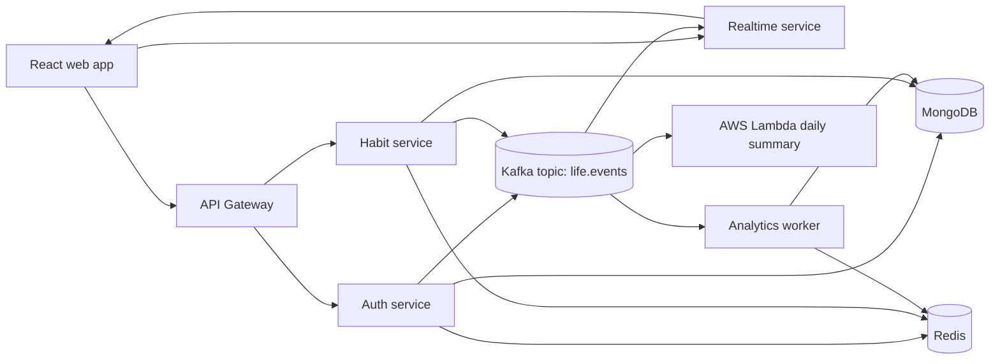

# LifeTracker

LifeTracker is a real-time personal growth platform built as a modern MERN portfolio
project. Users can register, create habits, complete daily check-ins, join public
challenges, unlock achievements, and watch updates stream live through the UI.

The product is intentionally consumer-facing: anyone can open it, register, and use it
without needing a company or team workspace. The implementation still uses production
patterns: microservices, domain events, Redis hot state, Kafka event streaming, Docker,
CI/CD, tests, and an AWS Lambda artifact.

## Stack

- React 19, Vite, TanStack Query, Recharts, Socket.IO client
- Node.js 24, Express, Socket.IO, Mongoose, Zod, JWT
- MongoDB, Redis, Kafka
- AWS Lambda handler for Kafka event-source summaries
- Docker Compose for local infrastructure and services
- GitHub Actions for quality checks and deploy handoff

## Architecture



## Local Run

This machine currently has Docker available, so Docker is the expected workflow.

```bash
docker compose build
docker compose run --rm --profile tools seed
docker compose up -d
```

Open:

- Web: http://localhost:3000
- API gateway health: http://localhost:4000/health
- Realtime health: http://localhost:4003/health

Demo account:

```text
demo@lifetracker.dev / demo1234
```

## Quality Gates

```bash
npm ci
npm run check
npm run build
docker compose config
```

`npm run check` runs ESLint, TypeScript checks, and Vitest tests across workspaces.

## Repository Layout

```text
apps/
  api-gateway/            public HTTP API gateway
  auth-service/           registration, login, JWT, sessions
  habit-service/          habits, check-ins, dashboard, challenges
  realtime-service/       Socket.IO and Kafka fanout
  analytics-worker/       Kafka consumer, achievements, projections
  lambda-daily-summary/   AWS Lambda Kafka event-source handler
  seed/                   demo data seeding
  web/                    React application
packages/
  backend-common/         JWT, Kafka, Redis, errors, validation
  database/               Mongoose models and database connection
  shared/                 Zod schemas, DTOs, event contracts
infra/
  aws/template.yaml       SAM template for the Lambda artifact
docs/
  ARCHITECTURE.md
  API.md
  DEPLOYMENT.md
  TESTING.md
```

## Portfolio Talking Points

- Consumer product that can later become a React Native app.
- Event-driven architecture with Kafka as the backbone.
- Redis used for sessions, cached dashboards, online presence, and leaderboards.
- Realtime UX via Socket.IO with authenticated connections.
- Lambda receives the same Kafka event contract used by the app.
- Microservices are independently containerized.
- Contracts are shared through Zod schemas and TypeScript types.
