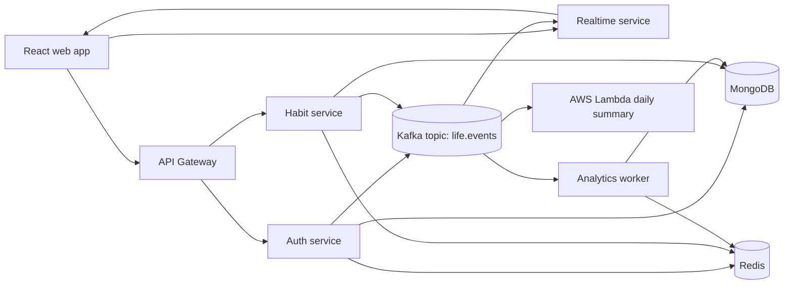

# lifetracker

lifetracker is a consumer-facing habit and progress tracker built as a modern
full-stack showcase. It combines a polished React experience with Node.js
services, MongoDB, Redis, Kafka, realtime updates, Docker, CI checks, and an AWS
Lambda integration.

The product goal is simple: a person can create habits, complete daily
check-ins, join live challenges, and see personal progress update in real time.
The engineering goal is broader: the repo demonstrates production-style
contracts, service boundaries, frontend quality, deployment readiness, and clear
documentation.

## What Is Inside

| Area        | What it shows                                                                                                   |
| ----------- | --------------------------------------------------------------------------------------------------------------- |
| Product app | Login, registration, habits, moods, challenges, progress charts, achievements, realtime feed                    |
| Frontend    | React 19, Vite, TanStack Query, Recharts, Socket.IO client, accessibility, SEO metadata, i18n, light/dark theme |
| UI Kit      | React-only shared components in `packages/ui` with a separate showcase on port `3001`                           |
| Backend     | Node.js 24, Express services, JWT auth, Zod validation, shared event contracts                                  |
| Data        | MongoDB for durable data, Redis for hot state, Kafka for domain events                                          |
| Ops         | Docker Compose naming contract, health checks, CI/CD handoff, AWS Lambda artifact                               |
| Docs        | User, admin, developer, deployment, Docker, API, testing, performance, SEO, and accessibility guides            |

## Quick Start

Docker is the expected local workflow for this project.

```bash
docker compose --profile tools build
docker compose up -d
docker compose --profile tools run --rm seed
```

Open:

| Surface            | URL                          |
| ------------------ | ---------------------------- |
| Web app            | http://localhost:3000        |
| UI Kit showcase    | http://localhost:3001        |
| API gateway health | http://localhost:4000/health |
| Realtime health    | http://localhost:4003/health |

Demo account:

```text
demo@lifetracker.dev / demo1234
```

## Documentation

### Repository Docs

| Guide                                              | Audience           | Purpose                                                                 |
| -------------------------------------------------- | ------------------ | ----------------------------------------------------------------------- |
| [Docs Index](docs/README.md)                       | Everyone           | Entry point for all repo documentation                                  |
| [User Guide](docs/USER_GUIDE.md)                   | Product users      | Features, account flow, habits, challenges, progress, languages, themes |
| [Admin Guide](docs/ADMIN_GUIDE.md)                 | Operators/admins   | Runtime services, availability, data, health checks, incident handling  |
| [Developer Guide](docs/DEVELOPER_GUIDE.md)         | Engineers          | Repo structure, local workflow, package boundaries, quality rules       |
| [Performance And SEO](docs/PERFORMANCE_AND_SEO.md) | Frontend/devops    | Metadata, sitemap, caching, web vitals, accessibility, verification     |
| [Architecture](docs/ARCHITECTURE.md)               | Engineers          | Services, data ownership, event flow, frontend contract                 |
| [API](docs/API.md)                                 | Engineers          | Gateway routes, auth, dashboard, habits, challenges, realtime events    |
| [Docker](docs/DOCKER.md)                           | Engineers/devops   | Images, containers, volumes, reset commands, naming contract            |
| [Deployment](docs/DEPLOYMENT.md)                   | Devops             | Production shape, secrets, Lambda, SEO deployment checklist             |
| [Testing](docs/TESTING.md)                         | Engineers/QA       | Automated gates, manual QA, browser checks, docs checks                 |
| [Frontend Quality](docs/FRONTEND_QUALITY.md)       | Frontend engineers | Accessibility, i18n, theme, bundle, cache, web vitals rules             |

### Site-Readable Markdown

Human-friendly Markdown docs are also shipped from the web app static folder.
After the web container is built, they can be opened directly:

| Public doc          | URL                                               |
| ------------------- | ------------------------------------------------- |
| Docs index          | http://localhost:3000/docs/README.md              |
| User guide          | http://localhost:3000/docs/user-guide.md          |
| Admin guide         | http://localhost:3000/docs/admin-guide.md         |
| Developer guide     | http://localhost:3000/docs/developer-guide.md     |
| Performance and SEO | http://localhost:3000/docs/performance-and-seo.md |

These files live in `apps/web/public/docs` and are copied by Vite into the
production web image.

## Architecture



Core flow:

1. A user signs in and opens the React dashboard.
2. The web app calls the API gateway.
3. Domain services write durable state to MongoDB.
4. Redis keeps sessions, presence, cached dashboards, and leaderboards fast.
5. Kafka carries lifecycle events such as habit completion and challenge joins.
6. Realtime and analytics consumers react to the same shared event contract.

More detail is in [docs/ARCHITECTURE.md](docs/ARCHITECTURE.md).

## Repository Layout

```text
apps/
  api-gateway/            public HTTP API gateway
  auth-service/           registration, login, JWT, sessions
  habit-service/          habits, check-ins, dashboard, challenges
  realtime-service/       Socket.IO and Kafka fanout
  analytics-worker/       Kafka consumer, achievements, projections
  lambda-daily-summary/   AWS Lambda Kafka event-source handler
  seed/                   demo data seeding
  ui-showcase/            React UI Kit showcase on port 3001
  web/                    React application and public Markdown docs
packages/
  backend-common/         JWT, Kafka, Redis, errors, validation
  database/               Mongoose models and database connection
  shared/                 Zod schemas, DTOs, event contracts
  ui/                     React-only UI Kit components and styles
docs/
  *.md                    repo documentation
infra/
  aws/template.yaml       SAM template for the Lambda artifact
```

## Quality Gates

```bash
npm ci
npm run check
npm run build
docker compose --profile tools config
```

`npm run check` runs package preparation, ESLint, TypeScript checks, and Vitest
tests across workspaces.

Browser and web-vitals checks use the gstack browse tool documented in
[docs/TESTING.md](docs/TESTING.md).

## SEO, Accessibility, And Web Vitals

The web app includes:

- indexable metadata, canonical URL, Open Graph, Twitter cards, JSON-LD,
  `robots.txt`, `sitemap.xml`, and a web app manifest;
- static public Markdown docs included in the sitemap;
- keyboard-accessible controls, skip link, semantic landmarks, live regions, and
  chart text alternatives;
- six supported languages: English, Russian, Spanish, German, French, Serbian;
- automatic language detection with persisted user choice;
- persisted light/dark theme with CSS variables;
- lazy-loaded dashboard bundles so logged-out users do not download chart and
  realtime code;
- Nginx cache rules for immutable hashed assets and short-lived public files.

See [docs/PERFORMANCE_AND_SEO.md](docs/PERFORMANCE_AND_SEO.md) and
[docs/FRONTEND_QUALITY.md](docs/FRONTEND_QUALITY.md).

## Docker Naming Contract

All local Docker resources use the `lifetracker` name. Application images are
tagged as `lifetracker-*:local`; persistent volumes are explicitly named by
purpose, for example `lifetracker-mongo-data`, `lifetracker-redis-data`, and
`lifetracker-kafka-data`.

No container, image, network, or volume should use the old `mern` prefix. The
full contract is in [docs/DOCKER.md](docs/DOCKER.md).

## Portfolio Talking Points

- Consumer product that can later become a mobile app.
- React-only frontend with shared UI Kit and separate component showcase.
- Event-driven backend with Kafka as the domain event backbone.
- Redis used for sessions, cached dashboards, online presence, and leaderboards.
- Realtime UX through authenticated Socket.IO connections.
- Shared Zod contracts across frontend, services, and Lambda.
- Docker, CI, deployment docs, SEO docs, and operator docs included.
